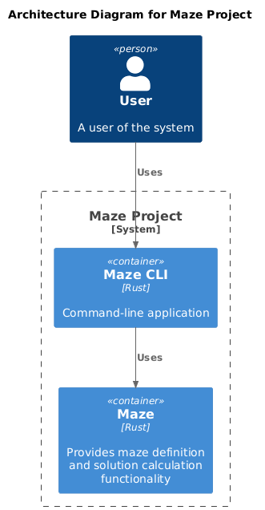
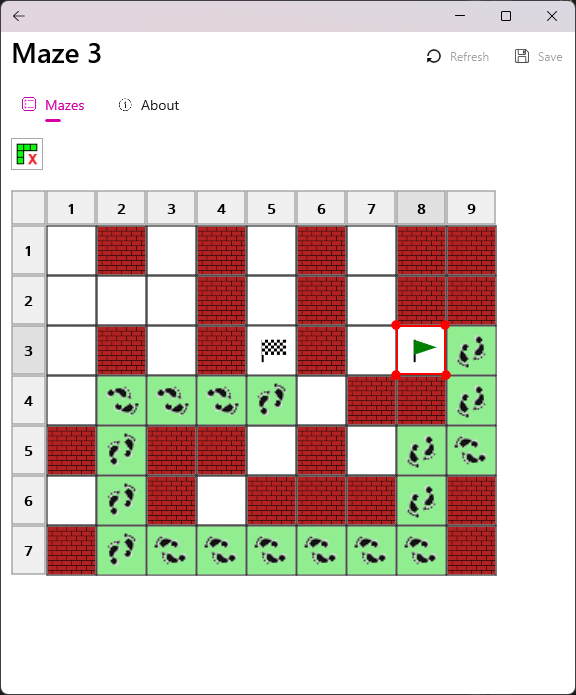
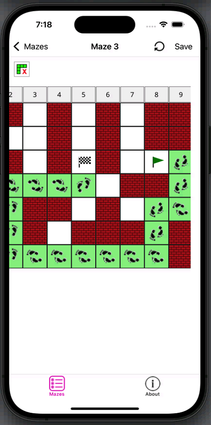
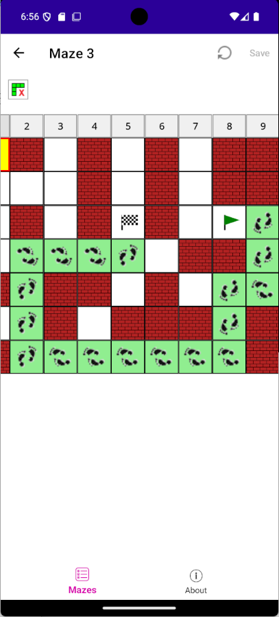

# maze

A multi-language experimental project exploring **Rust**, **C# (.NET 10)**, and **WebAssembly** interoperability. Built around a maze generation and solving domain, it demonstrates library crates, REST APIs, WASM bindings, OpenAPI, a cross-platform MAUI app, Node.js-based API testing, architecture diagramming with PlantUML, documentation generation with DocFX, and automated CI/CD across Windows, macOS, and Linux.

## Table of Contents
- [Introduction](#introduction)
- [Architecture](#architecture)
- [Screenshots](#screenshots)
- [Getting Started](#getting-started)
- [Contributing](#contributing)
- [License](#license)

## Introduction

> **Status:** Experimental — this project exists to explore language interoperability and is actively maintained but not intended for production use.

This is an experimental project that has been created for exploring various programming languages, technologies and language-to-language integration. At its core, it contains a set of tools and libraries for managing and solving mazes that are then utilised in various application scenarios.

At this stage, the following areas are covered:

- Creating library crates in `Rust`

- Creating a `Rust` console application ([`maze_console`](./src/rust/maze_console/README.md)) that leverages `Rust` library crates for calculation ([`maze`](./src/rust/maze/README.md)) and storage ([`storage`](./src/rust/storage/README.md))

- Implementing automated unit and mock testing (dependency injection) in `Rust` 

- Automating `Rust` documentation-generation with `cargo doc`

- Web Assembly implementation and generation (`wasm32` and `wasm-bindgen`) in `Rust` ([`maze_wasm`](./src/rust/maze_wasm/README.md))

- Generating JavaScript APIs from `Rust` crates (`wasm-pack`)

- Automating JavaScript API testing in `node.js` (`chai`, `mocha`)

- Creating a `Rust` web server application ([`maze_web_server`](./src/rust/maze_web_server/README.md)) that:
  - Leverages the `Rust` library crates for calculation ([`maze`](./src/rust/maze/README.md)) and storage ([`storage`](./src/rust/storage/README.md)) and exposes them as a `REST`ful Web API
  - Uses [`actix`](https://actix.rs/) to serve the `HTTPS` API and [`utoipa`](https://docs.rs/utoipa/latest/utoipa/) to publish it as an [`OpenAPI`](https://www.openapis.org/)-compliant interface for use in third party products such as [`Swagger`](https://swagger.io/)
  - Supports interactive documentation in the form of [RapiDoc](https://rapidocweb.com/), [Redoc](https://redocly.com/redoc) and [Swagger UI](https://swagger.io/tools/swagger-ui/)

- Implementing a `.NET` to Web Assembly ([`maze_wasm`](./src/rust/maze_wasm/README.md)) interop library ([`Maze.Wasm.Interop`](./src/csharp/Maze.Wasm.Interop/README.md)) in `C#` that supports [Wasmtime](https://docs.wasmtime.dev/) (for `Windows`, `Android` and `iOS`) and [Wasmer](https://wasmer.io/) (for `Android` and `iOS`)

- Implementing automated `.NET` API testing with `xUnit` ([`Maze.Wasm.Interop.Tests`](./src/csharp/Maze.Wasm.Interop.Tests/README.md))

- Implementing a `C#` [MAUI](https://dotnet.microsoft.com/en-us/apps/maui) application ([`Maze.Maui.App`](./src/csharp/Maze.Maui.App/README.md)) that utilises an underlying Web Assembly interop library ([`Maze.Wasm.Interop`](./src/csharp/Maze.Wasm.Interop/README.md)) via a wrapper API ([`Maze.Api`](./src/csharp/Maze.Api/README.md)) 

- Automating `C#` API documentation generation with `DocFX`

- Combining `C#` and `Rust` documentation into a single HTML help system with use of `iFrame` containers

- Architecture diagramming using `PlantUML` ([`architecture.puml`](./docs/diagrams/architecture.puml))

- Automating image generation workflows using GitHub Actions ([`generate-png-from-puml.yml`](./.github/workflows/generate-png-from-puml.yml))

- Automating build and testing workflows using GitHub Actions ([`build-and-test-components-multi-os.yml`](./.github/workflows/build-and-test-components-multi-os.yml))

- Automating GitHub Pages asset generation and deployment [`build-and-deploy-to-github-pages`](./.github/workflows/build-and-deploy-to-github-pages.yml)

The following components are present:

| Folder                         | Component                                                                     | Description
|--------------------------------|-------------------------------------------------------------------------------|---------------
| `.github/workflows`            | `*.yml`                                                                       | GitHub Action workflow files
| `docs`                         | [`README.md`](./docs/README.md)                                               | Project overview documentation
| `research/algorithms/excel`     | `maze-algorithms.xls`                                                         | Excel workbook containing maze algorithms
| `src`                          | [`docfx`](./src/docfx/README.md)                                              | HTML help generation
| `src/csharp`                   | [`Maze.Api`](./src/csharp/Maze.Api/README.md)                                 | .NET API that sits above  [`Maze.Wasm.Interop`](./src/csharp/Maze.Wasm.Interop/README.md)
|                                | [`Maze.Api.Tests`](./src/csharp/Maze.Api.Tests/README.md)                     | Unit tests for [`Maze.Api`](./src/csharp/Maze.Api/README.md)
|                                | [`Maze.Maui.App`](./src/csharp/Maze.Maui.App/README.md)                       | Maze [MAUI](https://dotnet.microsoft.com/en-us/apps/maui) application
|                                | [`Maze.Maui.Controls`](./src/csharp/Maze.Maui.Controls/README.md)             | Custom [MAUI](https://dotnet.microsoft.com/en-us/apps/maui) controls and definitions
|                                | [`Maze.Maui.Services`](./src/csharp/Maze.Maui.Services/README.md)             | Custom [MAUI](https://dotnet.microsoft.com/en-us/apps/maui) services
|                                | [`Maze.Wasm.Interop`](./src/csharp/Maze.Wasm.Interop/README.md)               | .NET interop to `maze_wasm` web assembly
|                                | [`Maze.Wasm.Interop.Tests`](./src/csharp/Maze.Wasm.Interop/README.md)         | .NET test library for [`Maze.Wasm.Interop`](./src/csharp/Maze.Wasm.Interop/README.md)
| `src/rust`                     | [`auth`](./src/rust/auth/README.md)                                           | Authentication library
|                                | [`data_model`](./src/rust/data_model/README.md)                               | Data model library
|                                | [`maze`](./src/rust/maze/README.md)                                           | Maze calculation library
|                                | [`maze_console`](./src/rust/maze_console/README.md)                           | Maze console application
|                                | [`maze_openapi_generator`](./src/rust/maze_openapi_generator/README.md)       | Maze OpenAPI generator console application
|                                | [`maze_wasm`](./src/rust/maze_wasm/README.md)                                 | Maze WebAssembly API library
|                                | [`maze_web_server`](./src/rust/maze_web_server/README.md)                     | Maze web server console application
|                                | [`storage`](./src/rust/storage/README.md)                                     | Maze storage library
|                                | [`utils`](./src/rust/utils/README.md)                                         | Utilities library

## Architecture

> See [`docs/diagrams/architecture.puml`](./docs/diagrams/architecture.puml) for the PlantUML source.

## Screenshots

The Maze MAUI application running on Windows, iOS, and Android, showing a solved maze.

| Windows | iOS | Android |
|---------|-----|---------|
|  |  |  |

## Getting Started

### Setup
To setup the build and test environment, you first need to install:

- [`.NET 10.0+`](https://dotnet.microsoft.com/en-us/download)
- [`Rust`](https://www.rust-lang.org/tools/install) (latest stable)
- [`Node.js 18+`](https://nodejs.org/en/learn/getting-started/how-to-install-nodejs)

To setup the `C#` build environment, refer to the [README](src/csharp/README.md) in the `csharp` directory.

To setup the `Rust` build environment, refer to the [README](src/rust/README.md) in the `rust` directory.

### Build

- To build the `C#` (`.NET`) APIs, refer to the [README](src/csharp/README.md) in the `csharp` directory.

- To build the `Rust` crates, refer to the [README](src/rust/README.md) in the `rust` directory.

### Generating Documentation
- To generate combined documentation for the `.NET` APIs and `Rust` crates, refer to the [README](src/docfx/README.md) in the `docfx` project.

- To generate documentation just for the `.NET` APIs, refer to the [README](src/csharp/README.md) in the `csharp` directory.

- To generate documentation just for the `Rust` crates, refer to the [README](src/rust/README.md) in the `rust` directory.

The combined output is deployed automatically to [GitHub Pages](https://budgiedownunder.github.io/maze/) on every push to `main`.

## Contributing
At this stage, this project is not accepting contributions.

## License
This software is licensed under the [MIT License](./LICENSE)
