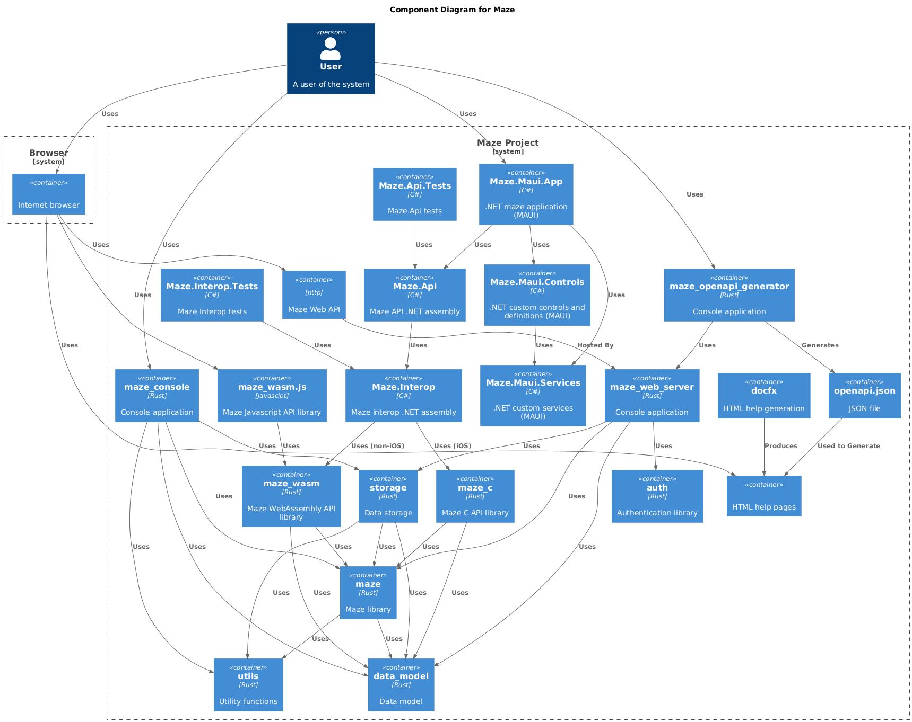

# Architecture 

The high-level architecture of the system is summarised below and illustrates how the [maze_wasm](../../src/rust/maze_wasm/README.md) WebAssembly is shared between both server/client-side applications and APIs:

## Components 

The various system components, together with their relationships, are:

