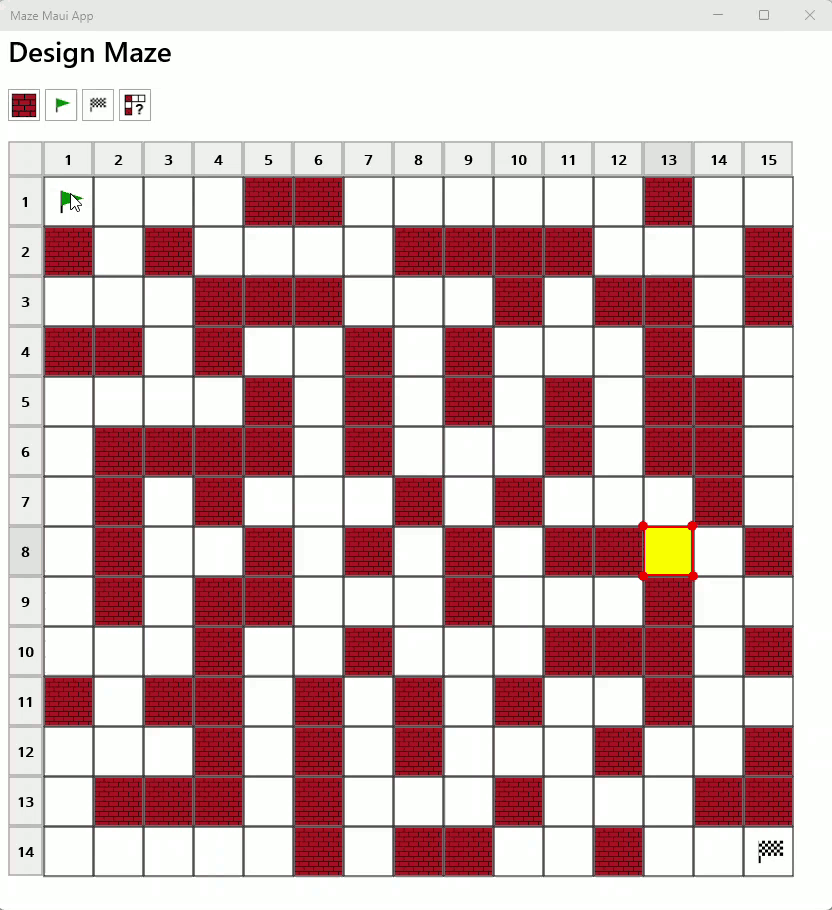
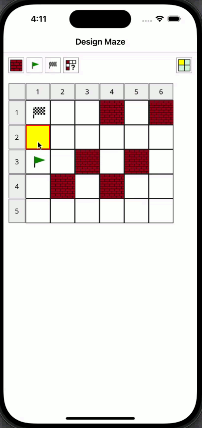

# `Maze.Maui.App` Application

## Introduction

The `Maze.Maui.App` .NET application is a work-in-progress [MAUI](https://dotnet.microsoft.com/en-us/apps/maui) application.

At the moment, it allows the user to:

- Design a maze containing start, finish and wall cells
- Attempt to solve the maze solution using the [`Maze.Api`](../Maze.Api/README.md) .NET assembly (desktop versions-only)

It  has been tested on `Windows` desktop and `Android`/`iOS` devices. The screenshots below show it running on `Windows` desktop:  

| Design      | Solved 
|-------------|--------
| | 

and these screenshots show it running on `Android` and `iOS` mobile devices:

| Android     | iOS 
|-------------|-------------
| | 

This short animation clip demonstrates it being used on `Windows` to solve a more complex maze before introducing a blocking wall that then forces the solver to go via a different route on the next solve attempt:



and this one shows the design process being performed on an `iOS` device using extended (animated) selection:



## Keyboard Support
In addition to mouse/pointer support on the desktop, the following keyboard shortcuts are supported for selecting/editing cells and cell navigation:

**Editing:**

| Shortcut    | Description  |
|:------------|:-------------|
| `F`         | Set `Finish` |
| `S`         | Set `Start`  |
| `W`         | Set `Wall`   |
| `Delete`      | Clear selection   |

**Navigation and Selection:**

| Shortcut        | Description       
|:----------------|:------------------
| `Shift`         | Extend selection  
| `↓`             | Move down
| `←`             | Move left
| `→`             | Move right
| `↑`             | Move upwards
| `End`           | Jump to end of row
| `Home`          | Jump to start of row
| `Ctrl`+ `←`     | Jump to start column 
| `Ctrl`+ `→`     | Jump to end column 
| `Ctrl`+ `↑`     | Jump to top row 
| `Ctrl`+ `↓`     | Jump to bottom row 
| `Ctrl`+ `End`   | Jump to last cell 
| `Ctrl`+ `Home`  | Jump to first cell 

## Getting Started

### Setup
To setup the build environment, run the following from the `Maze.Maui.App` directory:

```
dotnet restore
```

### Build
To build the `Maze.Maui.App` application, run the following from the `Maze.Maui.App` directory:

```
dotnet build
```

### Publishing

To publish the `Maze.Maui.App` to your local machine, run the following from the `Maze.Maui.App` directory:

Windows:

```
publish-release-windows.bat
```

This should build and register the application with `Windows`. You should then be able to locate  the `Maze Maui App` in the Windows Apps list and launch it.

### Testing
Automated testing is not implemented yet

