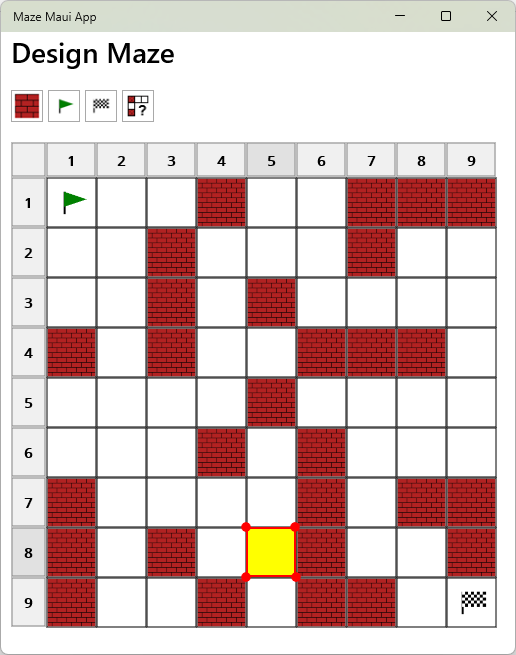
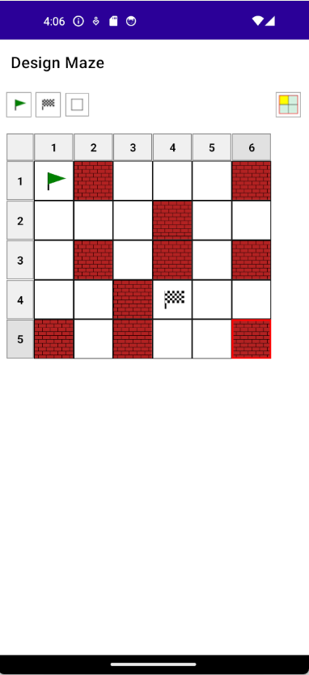
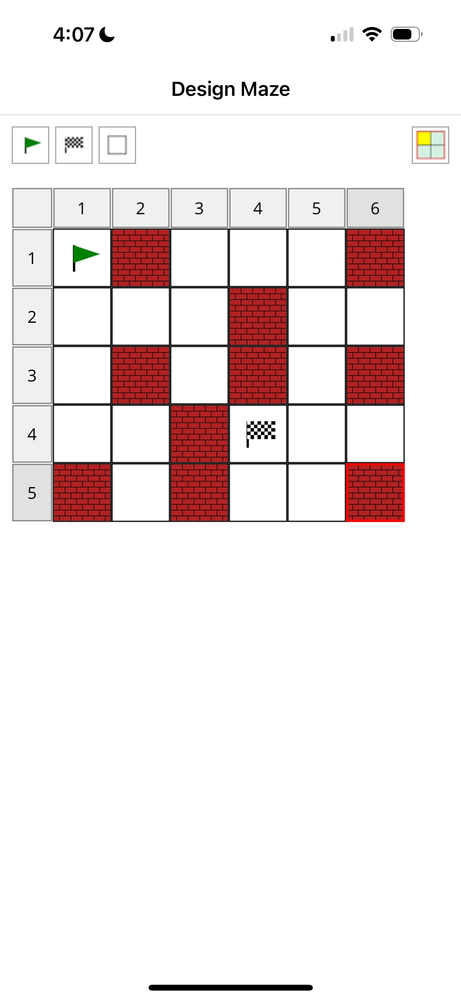

# `Maze.Maui.App` Application

## Introduction

The `Maze.Maui.App` .NET application is a work-in-progress [MAUI](https://dotnet.microsoft.com/en-us/apps/maui) application.

At the moment, it allows the user to:

- Design a maze containing start, finish and wall cells
- Attempt to solve and then display the solution, using the [`Maze.Api`](../Maze.Api/README.md) .NET assembly (desktop versions-only)

## Getting Started

### Setup
To setup the build environment, run the following from the `Maze.Maui.App` directory:

```
dotnet restore
```

### Build
To build the `Maze.Maui.App` application, run the following from the `Maze.Maui.App` directory:

```
dotnet build
```

### Publishing

To publish the `Maze.Maui.App` to your local machine, run the following from the `Maze.Maui.App` directory:

Windows:

```
publish-release-windows.bat
```

This should build and register the application with `Windows`. You should then be able to locate  the `Maze Maui App` in the Windows Apps list and launch it.

### Testing
Automated testing is not implemented yet

### Running - Desktop

The screenshots show the application running on `Windows`:  

| Design      | Solve       |
|-------------|-------------|
| |  |

### Running - Mobile

The screenshots show the application running on mobile devices:  

| Android | iOS |
|-------------|-------------|
| |  |

