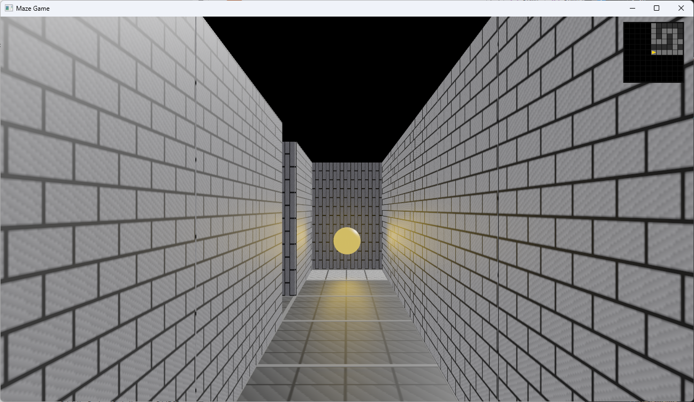

# `maze_game_bevy` Crate



## Introduction

The `maze_game_bevy` crate is written in `Rust` and provides the [Bevy](https://bevyengine.org/) game engine integration for the maze game. It compiles as both a library and a native desktop binary:

- The **library** owns all Bevy systems and app setup
- The **binary** runs the game as a native desktop application

### App flow

1. **Title screen** — layered gold "MAZE GAME" text displayed for 3 seconds, then auto-transitions to the playing state.
2. **3D maze world** — first-person PBR renderer. Wall panels are spawned on the exposed faces of passable cells, ensuring boundary walls are always visible even when the maze data has no explicit outer wall row. N/S-facing panels are a lighter stone grey; E/W-facing panels are darker, providing a directional shading cue at junctions.
3. **Finish orb** — an animated gold sphere hovers and bobs above the finish cell, illuminated by a shadow-casting point light that confines the glow to cells with line-of-sight to the orb.

The player starts at the start cell facing the first open neighbour cycling through S → E → N → W, so the initial view is always into an open corridor rather than a wall.

### Controls

| Input | Action |
|-------|--------|
| `←` / `A` | Turn left |
| `→` / `D` | Turn right |
| `↑` / `W` | Move forward |
| `Q` | Tilt camera up (clamped at +45°) |
| `E` | Tilt camera down (clamped at -90°, looking at the floor) |
| `Escape` | Quit |

Pitch is updated continuously at a fixed angular rate while `Q` or `E` is held. Turning and movement are gated by an animation lock, but pitch input is allowed to update during these animations (though not after winning).

On touch devices (browser and MAUI WebView) a D-pad overlay replaces keyboard input: five buttons in a two-row grid — tilt-up, move-forward, tilt-down on the top row, turn-left and turn-right on the bottom row. The tilt buttons are rendered slightly smaller with a chevron icon to distinguish them from the primary movement controls. The overlay is shown automatically when `pointer: coarse` is detected and hidden on desktop.

### Visual features

- Procedural brick-pattern texture on walls; stone-tile texture on floors — generated at runtime, no asset files required.
- Floor grid lines at cell boundaries for orientation feedback.
- Start cell highlighted green; finish cell highlighted white.
- Minimap overlay (top-right corner) — fixed 7×7 viewport centred on the player with fog of war; only explored cells and their immediate neighbours are revealed. Player position shown as a directional arrow.
- Win overlay — on reaching the finish cell, movement stops and a "You Win!" panel appears centred on screen.
- **Gold-leaf rain** — on win, small gold leaf sprites spawn continuously across the full screen width and fall with gentle rotation and drift, celebrating completion.

## Getting Started

### Build

To build the native binary:

```
cd src/rust
cargo build -p maze_game_bevy
```

### Run

To run the native desktop application:

```
cd src/rust
cargo run -p maze_game_bevy
```

### Testing

To test the `maze_game_bevy` crate:

```
cd src/rust
cargo test --locked -p maze_game_bevy
```
