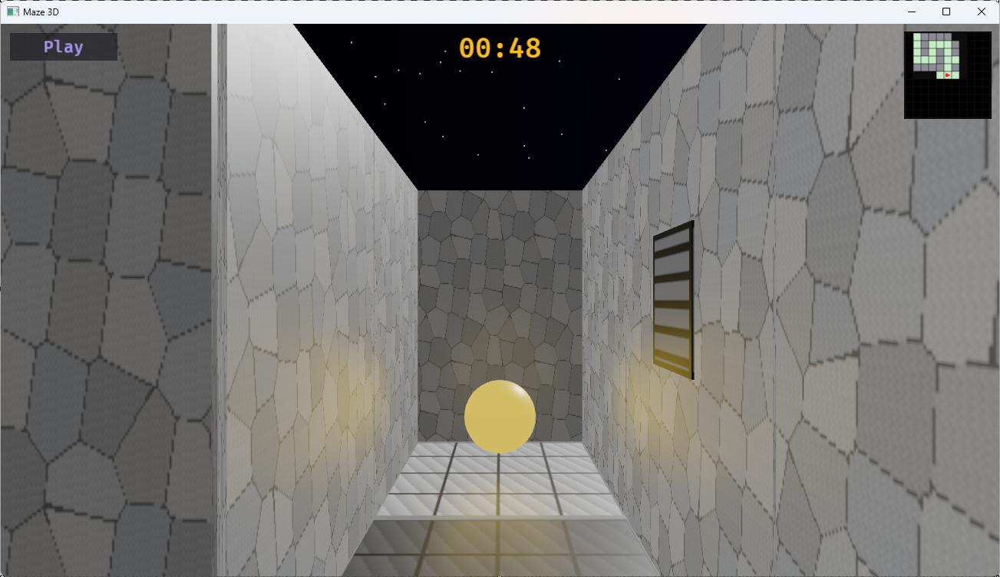

# `maze_game_bevy` Crate



## Introduction

The `maze_game_bevy` crate is written in `Rust` and provides the [Bevy](https://bevyengine.org/) game engine integration for the maze game. It compiles as both a library and a native desktop binary:

- The **library** owns all Bevy systems and app setup
- The **binary** runs the game as a native desktop application

### App flow

1. **Title screen** — layered gold title text displayed for 3 seconds, with a "Starting..." subtitle counting the seconds down to the auto-transition into the playing state.
2. **3D maze world** — first-person PBR renderer. Wall panels are spawned on the exposed faces of passable cells, ensuring boundary walls are always visible even when the maze data has no explicit outer wall row. N/S-facing panels are a lighter stone grey; E/W-facing panels are darker, providing a directional shading cue at junctions.
3. **Finish orb** — an animated gold sphere hovers and bobs above the finish cell, illuminated by a shadow-casting point light that confines the glow to cells with line-of-sight to the orb.

The player starts at the start cell facing the first open neighbour cycling through S → E → N → W, so the initial view is always into an open corridor rather than a wall.

### Controls

| Input | Action |
|-------|--------|
| `←` / `A` | Turn left |
| `→` / `D` | Turn right |
| `↑` / `W` | Move forward |
| `Q` | Tilt camera up (clamped at +45°) |
| `E` | Tilt camera down (clamped at -90°, looking at the floor) |
| `Space` | Pause / resume (freezes the timer and movement; "PAUSED" overlay shows) |
| `Escape` | Quit (native desktop). In the browser there's nothing to quit, so `Escape` toggles pause / resume like `Space`. |

Pitch is updated continuously at a fixed angular rate while `Q` or `E` is held. Turning and movement are gated by an animation lock, but pitch input is allowed to update during these animations (though not after winning).


### Visual features

- **Procedural brick-pattern** texture on walls; stone-tile texture on floors — generated at runtime, no asset files required.
- **Per-cell wall tint variation** — pick one of six emissive variants for for wall panels, so different corridor sections have different shades. Bypassed when **per-quadrant wall material variation** is on for that difficulty.
- **Configurable wall texture** — when **per-quadrant wall material variation** is off, the chosen wall texture (one of brick / dressed stone / wood / cobblestone) applies uniformly across the maze, with the per-cell tint variation still riding on top. Selected per difficulty via `[game.play3d.<difficulty>] wall_type`; default `brick`. Bypassed when **wall material variation** is on (same gating as `wall_tint`).
- **Non-occluding wall types** — beyond the four solid textures, a wall cell's `wallType` override (falling back to the per-maze `wall_type`) can skin it as a floor-level **water** or **lava** pool, or a see-through **iron-fence** grille, so it reads as something you can see across rather than an occluding barrier.
- **Per-quadrant wall material variation** — splits the maze into a 2×2 NW/NE/SW/SE grid; each quadrant renders with its own wall material (brick / dressed stone / wood / cobblestone), with the quadrant-to-kind mapping permuted by the seed so different seeds rotate which quadrant gets which material. Supersedes the per-cell tint variation AND the configured `wall_type` when on. Each difficulty can toggle this via `[game.play3d.<difficulty>.landmarks] wall_material_variation`. The wood and cobblestone textures are RGB-coloured at 128×128 with per-plank / per-cobble tone palettes (honey / oak / walnut / dark-walnut for wood; warm-light, warm-mid, brown-weathered, mossy-green for cobblestone); brick and dressed stone are still greyscale at 64×64 with emissive-tinted chromaticity.
- **Atmospheric sky modes** — `night` (dense stars on deep indigo), `sunrise` (soft warm pink with medium stars), `day` (sky-blue with broken white/grey clouds), `sunset` (warm orange with sparse dark clouds and sparse stars), and two enclosed modes, `dungeon` and `chamber`. The open-air modes each render a procedural panoramic dome around the player (gradient + cloud blobs baked into the dome texture; stars are tiny 3D entities parented to the dome so they stay angularly fixed in the sky as the player walks) and ship a paired ambient + directional light preset so the corridors visibly feel like the chosen time of day. The enclosed modes instead cap every passable cell with a ceiling tile at the top of the walls and dim the lighting, sealing the player in (the dome behind is near-black so the grout gaps between tiles read as dark seams): `dungeon` uses a hewn dark-rock ceiling (a tileable rock-face texture tinted by a dim emissive), while `chamber` uses the cell's own wall material so the maze reads as a finished, built interior (brick maze → brick ceiling, timber maze → timber ceiling). Each ceiling tile is inset so a grid of dark grout lines separates adjacent tiles — that structure is what keeps it reading as a solid coffered ceiling rather than open sky. Selected per difficulty via `[game.play3d.<difficulty>] sky_type`; default `night`.
- **Dead-end landmark objects** — every dead-end cell (passable cell with exactly one open neighbour, excluding start / finish) gets a distinctive landmark — a brazier, urn, broken pillar, or chest — picked by hashing `(row, col, seed)`. Each landmark is a composite of several scaled primitives (a brazier is column + bowl + halo with a sin-flicker on the bowl glow; an urn is a stacked-cylinder vase silhouette with two darker pattern bands wrapping the belly; a pillar is base + shaft + capital with vertical perimeter grooves around the discs; a chest is body + rounded lid + leather binding cross on every side face + lid-top binding + front-face keyhole). Every visible sub-mesh ships paired with a slightly-larger black sibling using the inverted-hull outline trick (`cull_mode: Face::Front`) so each part reads as distinct from its neighbours and from the corridor walls behind it. Each difficulty can toggle this via `[game.play3d.<difficulty>.landmarks] dead_end_objects`.
- **Sparse wall decorations** — ~1 in 10 wall panels gets a decorative emissive decoration (vent grate, faded poster, rune glyph, or glowing glass) projected on its inside face. Placement and kind are seeded from `(row, col, face, seed)` so the same maze always decorates the same walls. Each difficulty can toggle this via `[game.play3d.<difficulty>.landmarks] wall_decorations`.
- **Floor accents at junctions** — every 3- or 4-way junction cell (passable cell with more than two open neighbours, excluding start / finish) gets a single flat accent on its floor — moss, cracked tile, mosaic, or arcane sigil — picked by hashing `(row, col, seed)`. Reinforces "this is a decision point" memory. Each difficulty can toggle this via `[game.play3d.<difficulty>.landmarks] floor_accents`.
- **Keys, doors & a bag** — `K` cells render a glowing gold key — a ringed bow, shaft, and teeth, each paired with a black inverted-hull outline so the parts read distinctly — floating, bobbing, and slowly spinning a fixed clearance above its holder. Walk onto one to auto-collect it — the key rises and shrinks away in a brief flourish, leaving the holder behind as an emptied stand — adding it to the **bag HUD** (a row of grouped item chips centred along the bottom of the screen — each item type shown once as an icon with a rolling `xN` count: a key chip plus one chip per collected treasure style, each style with its own icon; a type whose count is zero is dropped, so the key chip disappears once keys are spent, and chips wrap onto rows above when they exceed the window width). `D` cells are **doors** rendered in the surrounding cell's wall material, marked with a brass keyhole and eligible for the same sparse wall decorations as ordinary wall panels. A door cell is locked — impassable from every side — until you hold forward against it while carrying a key, which consumes the key and opens it over ~1 s, permanently. How a door *opens* depends on the cell's shape: a **straight corridor** (two open edges on opposing sides) gets a single leaf that **swings** on a hinge; any other topology (corner, T-junction, open area) seals **each** open edge with a leaf that **slides down into the floor**, since a swing would sweep awkwardly through the open space. The key-holder base reuses the shared decorative-prop rigs — `pedestal` renders the broken **pillar**, `chest` the bound treasure **chest** (its lock face turned toward the corridor), and `floating-key` stands the key alone — and the door open-style (swing / slide / portcullis / dissolve) are each chosen per cell from the cell's `keyHolder` / `doorStyle` override, falling back to the per-maze `GameConfig.key_holder` / `GameConfig.door_style`. The built-in demo maze places a key in a dead-end and a door guarding the finish, so the mechanic is playable from `cargo run` with no maze authoring.
- **Enemies, HP & health pickups** — `E` cells spawn a moving enemy rig that bobs in place and chases the player along a wall-aware BFS shortest path at a fixed move period (default 1500 ms per cell, `N > E > S > W` tie-break on equal-distance choices). Two visual rigs — **Goblin** (default — green body with painted ear-to-ear mouth and per-side eyeballs) and **Ghost** (translucent floating figure with a hemisphere head, truncated-cone body, rippling sheet hem, and a glowing-red eyeball inside each arch-shaped eye) — are chosen per cell from its `enemyType` override, falling back to the per-maze `GameConfig.enemy_type`. Same-cell collisions — whether the player walks onto an enemy's cell or an enemy steps onto the player's cell — fire `GameEvent::PlayerDamaged` and a brief red damage-flash overlay; the **HP HUD** (top-left, "LIFE" label + a row of red heart icons that dim as HP drops) is rebuilt on every change. Reaching 0 HP routes through the same lose path as a wall-clock timeout — movement freezes and the lose overlay appears. `H` cells spawn a floating health pickup with a gentle scale pulse + Y-spin idle, its rig — **Heart** (default — two upper sphere lobes + a flat-faced downward pyramid tip whose corners tuck flush into the lobes) and **Potion** (capped bottle with a glowing liquid) — chosen per cell from its `healthStyle` override, falling back to the per-maze `GameConfig.health_style`. Auto-pickup on walk-over: when `hp < max_hp` the cell clears + a `PlayerHealed` event fires + HP increments; when `hp == max_hp` the cell stays + a `PlayerNotHealed` event surfaces an "already at full health" hint so the host can flash it.
- **Treasure** — `T` cells render an **open chest** (the shared chest rig with its lid swung open) heaped almost overflowing with loot: coins for **silver** / **gold**, faceted gems for **diamonds** / **jewels**, chosen per cell from the cell's `style` override (default silver). A ring of sparkles radiates from the loot beneath a style-tinted glow. The chest faces outward from a dead-end (and along a corridor) like the key-holder / dead-end chests, and at a dead-end treasure takes precedence over the landmark prop. Walk onto it to auto-collect: the loot rises and shrinks away in a brief flourish while the open chest stays behind, emptied (the engine clears the cell so it can't be re-collected). The collected value is folded into the run score via `MazeGame::score`, and a per-style treasure chip appears in the bag HUD. The built-in demo places one bare (silver) treasure in a dead-end so it's playable from `cargo run`.
- **Back-edge camera viewpoint** — instead of standing at the dead-centre of each cell, the camera sits behind the cell centre in the direction opposite the player's facing. This brings perpendicular openings (corridors on the left or right of the current cell) into a glancing angle inside the Field of View (FOV) rather than leaving them at 90° off-axis, and keeps the wall directly ahead a comfortable distance away. Turning the camera in place orbits it to the back edge relative to the new facing, so the player always reads as standing at the "back" of their cell looking forward.
- **Adaptive FOV** — the camera's vertical FOV is configured at 60° for the reference 16:9 viewport (≈91° horizontal at that aspect). On viewports narrower than the reference (phone portrait, tall windows), the vertical FOV grows so the horizontal FOV stays constant — a perpendicular opening that's visible on desktop is still visible on a phone in portrait. Capped at 100° vertical to prevent fisheye on extreme-portrait viewports.
- Floor grid lines at cell boundaries for orientation feedback.
- Start cell highlighted green; finish cell highlighted gold.
- **Score overlay** (top-left corner) — a live readout of the run's score (`MazeGame::score()`), updated each frame as the player progresses.
- Status bar overlay (bottom-left corner) — a row container that displays the configured `mode` label.
- **Minimap overlay** (top-right corner) — fixed viewport centred on the player; only explored cells and their immediate neighbours are revealed. A muted footer strip directly below it shows the maze's dimensions as `width x height` (columns × rows). The whole panel (footer included) re-anchors to the window's top-right corner on resize.
- **Win overlay** — on reaching the finish cell, movement stops and a "You Win!" panel appears centred on screen, showing the run's final score and its elapsed time to millisecond precision (`M:SS.mmm`). The on-screen clock only shows the remaining countdown to whole seconds, so the win panel is where the precise completion time surfaces.
- Gold-leaf rain — on win, small gold leaf sprites spawn continuously across the full screen width and fall with gentle rotation and drift, celebrating completion.
- **Lose overlay** — on not completing in time, or on reaching 0 HP from enemy collisions, movement stops and a "You Lose!" panel appears centred on screen.
- Rain-Lightning — on lose, rain sprites spawn continuously across the full screen width and fall accompanied by periodic lightning flashes.

## Getting Started

### Build

To build the native binary:

```
cd src/rust
cargo build -p maze_game_bevy
```

### Run

To run the native desktop application:

```
cd src/rust
cargo run -p maze_game_bevy
```

Set `MAZE_DEMO` to swap the built-in demo for a **rig gallery** — a maze that
places each entity-rig variant beside its default, for eyeballing the rigs
without authoring a maze. The value selects which types to show:

| `MAZE_DEMO` | Shows |
|:------------|:------|
| `gallery`   | everything (enemy goblin/ghost, health heart/potion, key pedestal/chest/floating-key, door swing/slide/portcullis/dissolve, treasure silver/gold/diamonds/jewels) |
| `enemies`   | enemy rigs only (goblin, ghost) |
| `health`    | health rigs only (heart, potion) |
| `keysdoors` | key + door rigs only (key pedestal/chest/floating-key, door swing/slide/portcullis/dissolve) |
| `treasure`  | treasure rigs only — open chests of each style (silver / gold coins, diamond / jewel gems) in dead-end alcoves |
| `walls`     | wall types only — a spine flanked by the solid textures (brick / dressed stone / wood / cobblestone) and the non-occluding types (water / lava / iron fence) |
| `multilevel`| a walkable multi-level pyramid (bottom level live, the rest static): an open `9×9` platform at the bottom, a `5×5` above, a `3×3` on top, each rendered a `LEVEL_HEIGHT` higher with an open perimeter so the platforms read as floating layers; reaching a level's finish lifts you onto the next. Only the top platform keeps the finish orb, on its far corner in the open - layers currently edge-aligned to a common corner.|

Focused values make it easy to verify one type in isolation. Enemies are
stationary and harmless so you can inspect them freely; in the key/door galleries
walk the spine collecting keys, then open each door to see its motion. The
examples below use `gallery`; substitute any value from the table.

Bash:

```bash
cd src/rust
MAZE_DEMO=gallery cargo run -p maze_game_bevy
```

PowerShell (the variable persists for the session — clear it afterwards with
`$env:MAZE_DEMO = $null`):

```powershell
cd src/rust
$env:MAZE_DEMO = 'gallery'; cargo run -p maze_game_bevy
```

### Testing

To test the `maze_game_bevy` crate:

```
cd src/rust
cargo test --locked -p maze_game_bevy
```

## Source layout

The crate is organised into focused per-concern modules under `src/`:

```
src/
├── lib.rs                  module decls + public re-exports + build_app
├── palette.rs              cross-module colour constants
├── state.rs                shared state / config types (GameConfig, EnemyType, HealthStyle, GameState, MultiLevelRun, etc.)
├── images.rs               generic Bevy Image factory (sampler-tuned)
├── movement.rs             input + animation + quit
├── tick.rs                 central game_tick_system + damage-flash overlay system
├── outcome.rs              outcome_watcher_system (win / lose detection from MazeGame state)
├── world/                  3D scene construction
│   ├── mod.rs              spawn_world orchestrator + grid helpers
│   ├── gallery.rs          MAZE_DEMO rig-gallery demos (focus selector + maze JSON)
│   ├── levels.rs           multi-level generation: N chained level grids (generate_level_maze_jsons)
│   ├── textures/           shared procedural world textures
│   │   ├── mod.rs          module declarations
│   │   ├── brick.rs        make_brick_texture (consumed by walls)
│   │   ├── cobblestone.rs  make_cobblestone_texture (wall material variant)
│   │   ├── dressed_stone.rs make_dressed_stone_texture (wall material variant)
│   │   ├── rock.rs         make_rock_texture (tileable rock face for the dungeon ceiling)
│   │   ├── tile.rs         make_tile_texture (consumed by floor tile/start/finish)
│   │   └── wood.rs         make_wood_texture (wall material variant)
│   ├── floor/              floor cells, grid lines, start, finish
│   │   ├── mod.rs          FloorCell marker + FloorAssets bundle + spawn_floor_for_cell
│   │   ├── tile.rs         default-tile material + spawn helper
│   │   ├── lines.rs        FloorLine, line meshes + material + spawn_lines_for_cell
│   │   ├── start.rs        StartCell + start material + spawn helper
│   │   └── finish.rs       FinishCell + finish material + spawn helper
│   ├── walls/              wall panels + non-occluding wall types
│   │   ├── mod.rs          WallAssets bundle, wall-material kinds + override resolver, wall-type classifiers, non-occluding dispatch
│   │   ├── solid/          solid-wall panel rendering
│   │   │   ├── mod.rs      spawn_walls_for_cell + per-cell tint / per-quadrant material hashes + panel suppression (face/edge logic)
│   │   │   ├── ns_panel.rs N/S-facing panel mesh, materials, spawn helper
│   │   │   └── ew_panel.rs E/W-facing panel mesh, materials, spawn helper
│   │   ├── water.rs        WaterSurface + water_animation_system — recessed bluish pool that undulates with scrolling ripples
│   │   ├── lava.rs         LavaSurface / LavaRock / LavaSteam + lava_(animation|steam)_system — recessed molten pool: scrolling ripples, bobbing rocks, rising steam dots
│   │   ├── rim.rs          PoolRim — textured basin-wall skirts around recessed pools (water/lava)
│   │   └── iron_fence.rs   IronFenceBars — see-through vertical bar grilles on the cell's open edges
│   ├── decorations/        wall decorations + floor accents
│   │   ├── mod.rs          DecorationAssets bundle + spawn_decorations_for_cell (delegates to wall + floor)
│   │   ├── wall/           sparse wall decorations
│   │   │   ├── mod.rs      shared mesh/dims + placement hash + spawn_wall_decorations_for_cell
│   │   │   ├── vent.rs     vent-grate texture + material
│   │   │   ├── poster.rs   faded-poster texture + material
│   │   │   ├── rune.rs     rune-glyph texture + material
│   │   │   └── glowing_glass.rs leaded glowing-glass texture + material
│   │   └── floor/          junction floor accents (placement seeded)
│   │       ├── mod.rs      FloorAccent + FloorAccentAssets + is_junction + floor_accent_index
│   │       ├── moss.rs     moss-patch texture + material
│   │       ├── cracked_tile.rs cracked-tile texture + material
│   │       ├── mosaic.rs   concentric-mosaic texture + material
│   │       └── sigil.rs    pentagram-sigil texture + material
│   ├── objects/            3D physical objects placed in the world
│   │   ├── mod.rs          ObjectAssets bundle (incl. shared CommonObjectAssets) + spawn_objects_for_cell (finish, dead-end, key holders, doors, enemies, health, treasure)
│   │   ├── overrides.rs    per-cell rig resolvers (cell override → default) for every per-cell entity rig
│   │   ├── common/         shared decorative-prop rigs + helpers (used by dead_end AND key_holder)
│   │   │   ├── mod.rs      CommonObjectAssets + spawn_with_outline (optional parent) + emissive/outline material helpers + OUTLINE_SCALE + yaw_toward_open_neighbour
│   │   │   ├── brazier.rs  brazier rig + BrazierBowl marker + brazier_flicker_system
│   │   │   ├── urn.rs      urn rig + materials
│   │   │   ├── pillar.rs   broken-pillar rig + materials + TOP_Y apex
│   │   │   └── chest.rs    chest rig (hollow trunk: floor + 4 walls so an open chest shows its interior edges; ChestLid Closed/Open; yaw-oriented; lock only when closed) + materials + TOP_Y apex
│   │   ├── finish/         objects placed at the finish cell
│   │   │   ├── mod.rs      FinishAssets bundle + spawn_finish_for_cell ('F' predicate)
│   │   │   └── orb.rs      FinishOrb + orb mesh/material/light + orb_system
│   │   ├── dead_end/       dead-end landmark objects (placement seeded)
│   │   │   └── mod.rs      DeadEndObject anchor + hash + is_dead_end + dispatcher into common::{brazier,urn,pillar,chest}
│   │   ├── key_holder/     'K' cells: a glowing outlined floating key above a common base rig (pillar / chest / none)
│   │   │   └── mod.rs      KeyMarker / FloatingKey + key-only assets + spawn (reuses common rigs) + key_holder/collection/sparks systems
│   │   ├── door/           'D' cells: door leaves (a view of the door's lock state)
│   │   │   ├── mod.rs      DoorMarker + topology dispatch + tick / animation systems
│   │   │   ├── panel.rs    the wall-material door slab
│   │   │   ├── keyhole.rs  brass lock plate + dark keyhole cutout
│   │   │   ├── swing.rs    swinging-leaf rig (straight corridors)
│   │   │   └── slide.rs    sliding-leaf rig (corners / junctions; retracts into floor)
│   │   ├── enemy/          'E' cells: a moving rig that chases the player
│   │   │   ├── mod.rs      EnemyMarker + EnemyAssets dispatcher (by per-cell enemyType override, else GameConfig.enemy_type) + shared animation system
│   │   │   ├── goblin.rs   default goblin rig: green body with painted mouth and per-side eyeballs
│   │   │   └── ghost.rs    ghost rig: hemisphere head + truncated-cone body + rippling hem + arch eyes with glowing-red pupils
│   │   ├── health/         'H' cells: floating pickup with idle pulse + spin
│   │   │   ├── mod.rs      HealthMarker + HealthAssets dispatcher (by per-cell healthStyle override, else GameConfig.health_style) + shared animation system
│   │   │   ├── heart.rs    default heart rig: two upper sphere lobes + flat-faced downward pyramid tip flush with the lobes
│   │   │   └── potion.rs   potion rig: capped bottle with a glowing liquid
│   │   └── treasure/       'T' cells: a free-standing open chest + collectible loot pile (coins/gems by style) with a radiating sparkle ring
│   │       ├── mod.rs      TreasureMarker / TreasureLoot + open chest + loot piles baked once into shared combined meshes + sparkle / collection systems
│   │       ├── silver.rs   silver-coin loot material + spawn
│   │       ├── gold.rs     gold-coin loot material + spawn
│   │       ├── diamonds.rs clear-gem loot material + spawn
│   │       └── jewels.rs   multi-colour gem loot palette + spawn
│   ├── sky/                sky / atmosphere modes
│   │   ├── mod.rs          spawn_sky dispatcher + shared util fns (PRNG, sRGB byte conv)
│   │   ├── dome.rs         inverted-sphere dome + camera-follow system
│   │   ├── procedural.rs   sky-dome backdrop (gradient baker + make_sky_texture orchestrator)
│   │   ├── clouds.rs       cloud blobs painted into the dome texture (CloudSpec + paint)
│   │   ├── stars.rs        3D entity starfield (tiny emissive spheres, parented to dome)
│   │   ├── day/mod.rs      bright sky-blue with broken clouds
│   │   ├── night/mod.rs    deep indigo with dense stars
│   │   ├── sunrise/mod.rs  soft warm pink with medium stars
│   │   ├── sunset/mod.rs   warm orange with sparse clouds + sparse stars
│   │   ├── dungeon/mod.rs  enclosed: near-black cool dome + dim light (pairs with roof/dungeon.rs)
│   │   └── chamber/mod.rs  enclosed: near-black warm dome + dim light (pairs with roof/chamber.rs)
│   └── roof/               per-cell ceiling for the enclosed sky types
│       ├── mod.rs          RoofCell + shared inset-tile mesh + per-sky-type dispatch
│       ├── dungeon.rs      dark-rock ceiling material (textures/rock.rs)
│       └── chamber.rs      ceiling in the cell's wall material
├── hud/                    HUD overlays
│   ├── mod.rs              module declarations
│   ├── minimap.rs          top-right minimap overlay
│   ├── statusbar.rs        bottom-left mode label
│   ├── score.rs            top-left live score readout (cumulative across a multi-level run)
│   ├── level.rs            level readout (multi-level runs only)
│   ├── clock.rs            top-centre countdown clock + lose-state trigger
│   ├── hp.rs               top-left "LIFE" label + red-heart icon row, rebuilt on every HP change
│   └── bag/                bottom inventory HUD
│       ├── mod.rs          BagHud + bag_hud_system (grouped per-type icon + ×N chips, wrapping, rebuilt on change)
│       ├── treasure.rs     per-style procedural treasure icons (silver/gold ingot bar, bright diamond, quartered jewels)
│       └── key.rs          procedural key-icon texture
└── overlays/               full-screen modal layers
    ├── mod.rs              module declarations
    ├── title.rs            title-screen splash
    ├── win.rs              win panel + gold-leaf rain
    ├── lose.rs             lose panel + rain + lightning (timer expiry or HP = 0)
    └── pause.rs            paused overlay
```

`spawn_world` is a thin orchestrator: it resolves the run's level set into
`GameState` (the bottom level is live) + `GameClock`, spawns the camera and the
sky, builds per-domain asset bundles (`walls`, `floor`, `decorations`,
`objects`), then renders every level stacked on the Y axis — `spawn_level` runs a
per-cell loop calling each domain's `spawn_*_for_cell` (including the door leaves,
enemy rigs, and health-pickup rigs, which are spawned alongside the loop
because they borrow either the cell's wall material or the per-config rig
choice), lifting every Y by `world_y(level, …)` (`LEVEL_HEIGHT` per level, so
level 0 is unchanged). Only the top level keeps the finish orb. It finishes with
the HUD (clock, score, status bar, minimap, HP, bag) + paused-overlay spawns. The only items re-exported through `lib.rs` are
`build_app`, `generate_maze_json`, `generate_level_maze_jsons` (multi-level:
N chained level grids, bottom first), `MAX_LEVEL_COUNT`, and the public types
`GameConfig`, `Landmarks`, `SkyType`, `WallType`, `EnemyType`, `HealthStyle`,
`TreasureStyle`, `LevelDifficultyChange`, `GameOutcome`, `GameResult`.
Everything else is `pub(crate)` or fully private.
